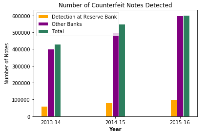

# Indian Counterfeit Banknote Detection using SVM

## Objective 
Currency counterfeiting is a serious crime that affects a country's finances. India is facing more serious problems due to the increase in fake notes in the market. To get rid of this problem, various fake note detection methods are available worldwide, but most of them are hardware based and costly. The proposed system can identify the legitimacy of a banknote by checking for specific security features such as watermarks, latent images, security threads, etc. Identification of counterfeit banknotes is done using machine learning techniques.

### Statistics of Detected Counterfeit Banknotes

For reference please visit original document : https://github.com/whimian/SVM-Image-Classification/blob/master/Image%20Classification%20using%20scikit-learn.ipynb
